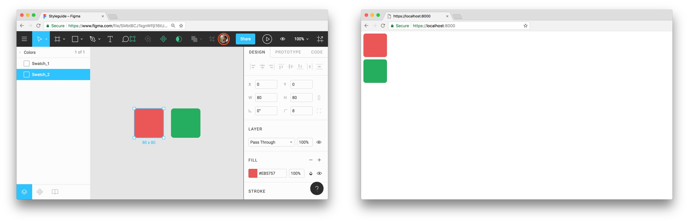

# gatsby-source-figma

[](http://makeapullrequest.com)
[](https://npm.im/gatsby-source-figma)

Gatsby plugin for using [Figma](https://figma.com) documents as a data source.



## Installation

    yarn add gatsby-source-figma

## Usage

```javascript
// In your gatsby-config.js

plugins: [
  {
    resolve: `gatsby-source-figma`,
    options: {
      // For files:
      fileId: `FIGMA_FILE_ID`,
      // For projects:
      projectId: `FIGMA_PROJECT_ID`,
      // Get an access token from Figma Account Settings.
      accessToken: `YOUR_FIGMA_ACCESS_TOKEN`,
    },
  },
],
```

Passing a `fileId` or `projectId` and an `accessToken` is required. You can create an access token inside your [Figma settings](https://www.figma.com/developers/docs#auth-dev-token).

## Querying

### Files

Make sure that `fileId` and `accessToken` are set inside `gatsby-config.js`.

```graphql
query StyleguideQuery {
  figmaDocument {
    name
    lastModified
    thumbnailUrl
    pages {
      name
      children {
        name
      }
    }
  }
}
```

### Projects

Make sure that `projectId` and `accessToken` are set inside `gatsby-config.js`.

```graphql
query ProjectQuery {
  allFigmaDocument {
    edges {
      node {
        name
        pages {
          name
        }
      }
    }
  }
}
```

Use the built-in GraphiQL tool (http://localhost:8000/___graphql) to get an idea of what you can query.

## Todo

* [x] Query `files`.
* [ ] Query multiple `files`.
* [ ] Query file `images`.
* [x] Query `projects`.
* [ ] Query file `comments`.

## Author

* Fabian Schultz ([@fschultz\_](https://twitter.com/fschultz_))
